# 📘 Báo cáo quy trình AI Coding — PMS VNU-HCM

**Dự án:** Hệ thống Quản lý Nhiệm vụ KH&CN — ĐHQG TP. Hồ Chí Minh (frontend demo từ Figma)
**Người thực hiện:** Lê Quốc Ngô
**Thời gian:** 1 session liên tục ~4.5h làm việc thuần
**AI tool chính:** Claude Code (model `claude-opus-4-7`) + Figma MCP
**Stack:** Next.js 15.5.15 · React 19 · TypeScript strict · Tailwind v4 · shadcn/ui (base-nova) · react-hook-form · zod · lucide-react · date-fns

**Mục đích báo cáo:** Ghi lại **quy trình** làm việc với AI agent để sinh giao diện từ Figma — không phải tech spec. Mỗi milestone nêu rõ: gõ prompt gì, AI làm gì, người review/sửa gì, quyết định vì sao.

📊 Số liệu thống kê kỹ thuật chi tiết: xem [`docs/ai-coding-metrics.md`](docs/ai-coding-metrics.md).

---

## 0. TL;DR

Dùng Claude Opus 4.7 + Figma MCP để code frontend demo từ file Figma 22 frames. Qua **14 milestone chính**, trải từ research → plan → auto-implement → fix → review 2 vòng → rebuild theo screenshots Figma bổ sung. Kết quả: **28 static routes**, 2 theme (navy admin / emerald NKH), flow end-to-end hoạt động. **Tổng ~4.5h AI vs ước ~50h code tay → tiết kiệm ~92%**. AI sai **11 điểm** phải sửa tay (base-nova API, server→client serialization, theme drift, data inconsistency, v.v.) — liệt kê đầy đủ ở §5. Báo cáo tập trung vào **HOW tôi làm việc với AI**, không phải WHAT được build.

---

## 1. Workflow tổng quan

```mermaid
flowchart TD
    Start([Input: Figma 22 frames<br/>+ brief 'code frontend demo']) --> M1

    M1[M1 · Research Figma<br/>Claude + MCP + subagent<br/>→ Report 400 dòng]
    M1 --> M2[M2 · Plan 11 phase<br/>AskUserQuestion 4 clarify<br/>stack/scope/data/i18n]
    M2 --> M3[M3 · Scaffold Next 15<br/>+ shadcn + 19 primitives]
    M3 --> M4[M4 · Auto-implement<br/>Phase 02→11 · batch 40 files]

    M4 --> check1{Build pass?}
    check1 -->|4 bugs: base-nova quirks| M5[M5 · Fix build errors<br/>LinkButton wrapper<br/>Server→Client boundary]
    M5 --> M6
    check1 -->|pass| M6[M6 · Logo fix + SVG charts<br/>pure no-lib]

    M6 --> decide1{User: luồng<br/>nghiệp vụ sai}
    decide1 --> M7[M7 · Plan restructure<br/>NKH primary + Admin superuser]
    M7 --> M8[M8 · Execute restructure<br/>Route groups + mock auth]

    M8 --> M9[M9 · Code review #1<br/>3 Critical + 6 Important findings]
    M9 --> M10[M10 · Fix 14 findings<br/>derive dashboard data, a11y, etc.]
    M10 --> M11[M11 · tsconfig + dropdown fix]

    M11 --> feedback1{User: Figma<br/>screenshots khác code}
    feedback1 --> M12[M12 · Rebuild 4 admin screens<br/>Thành viên, Nộp HS, Ký HĐ, Nhật ký]
    M12 --> M13[M13 · NKH emerald theme<br/>+ 4 new pages + 5-step ký số]

    M13 --> M14[M14 · Code review #2<br/>+ Rebuild 3 wizard tabs · Modal]
    M14 --> Done([Demo-ready<br/>28 static routes · build pass<br/>flow end-to-end])

    style M1 fill:#e0f2fe,stroke:#0284c7
    style M2 fill:#e0f2fe,stroke:#0284c7
    style M5 fill:#fef3c7,stroke:#d97706
    style M9 fill:#fce7f3,stroke:#db2777
    style M14 fill:#fce7f3,stroke:#db2777
    style Done fill:#d1fae5,stroke:#059669
```



**4 loại mốc (tô màu khác nhau trong diagram):**
- 🔵 **Research/Plan** (M1, M2) — nền
- 🟡 **Fix** (M5) — khi AI sai
- 🟣 **Review** (M9, M14) — kiểm chất lượng
- 🟢 **Done** — output cuối

---

## 2. Timeline chi tiết — 14 milestone

Mỗi milestone ghi theo format **[Prompt → AI làm → Review/sửa → Quyết định vì sao]**.

### M1 — Research Figma → báo cáo scope

**Prompt (nguyên văn):**
> "tôi cần bạn research [URL Figma] để biết ta cần thiết kế trang web gì, tôi được giao nhiệm vụ là code front end cho website Quản lý Khoa học Công nghệ để demo"

**AI làm:**
- Pull Figma metadata qua MCP — file 250KB vượt token limit → tự spawn subagent parse XML, trả về summary
- Pull thêm 2 design context (Login + Danh sách nhiệm vụ) để sample brand colors
- Viết report 400 dòng tại `plans/reports/researcher-260418-2044-figma-pms-vnuhcm-scope.md`

**Tôi review/sửa:** Đọc qua report, xác nhận scope 20 màn thực + 2 phụ, tokens chính xác. Không cần sửa.

**Decision WHY:** Research trước khi plan — tránh code nhầm scope. Subagent pattern cho file lớn → giữ context chính gọn.

**Thời gian:** 10 phút.

---

### M2 — Plan 11 phase với clarifying questions

**Prompt:**
> "tôi cần code hết các trang figma, sử dụng nextjs 15, hãy lên plan để apply cho tôi"

**AI làm:**
- Dùng `AskUserQuestion` hỏi 4 câu: tech stack / scope / data layer / i18n
- Tôi chọn: Next.js 15 + TS + Tailwind + shadcn · 20 màn full · Mock TS · tiếng Việt hardcode
- Tạo plan dir `plans/260418-2051-pms-vnuhcm-figma-to-nextjs/` với `plan.md` + 11 phase file chi tiết

**Tôi review/sửa:** Đọc nhanh plan, thấy cấu trúc rõ (mỗi phase có files/todo/success criteria) → approve.

**Decision WHY:** Plan kỹ trước khi batch-write → tiết kiệm 2-3h vs code rồi sửa. Hỏi clarify 30s thay vì đoán.

**Thời gian:** 15 phút.

---

### M3 — Scaffold Next.js + shadcn

**Prompt:**
> "bắt đầu code với tư duy lập trình viên cho tôi để hoàn thiện project frontend --auto-mode"

**AI làm:**
- `npx create-next-app@15 web/ ...` — **pin version 15** để tránh Next 16 breaking changes
- `npx shadcn init -d` + `shadcn add` 19 primitives
- Install `lucide-react`, `react-hook-form`, `zod`, `@hookform/resolvers`, `date-fns`
- Copy logo user-provided vào `public/`
- Update `app/layout.tsx`: Inter font subset `vietnamese`, lang `vi`, metadata PMS

**Tôi review/sửa:** Xoá boilerplate SVG Next (next.svg, vercel.svg, globe.svg). Xác nhận font load đúng.

**Decision WHY:** Pin Next 15 vì `create-next-app@latest` kéo về 16 — có breaking changes chưa document đầy đủ. Demo cần ổn định.

**Thời gian:** 5 phút.

---

### M4 — Auto-implement Phase 02→11

**Prompt:** flag `--auto-mode` (tiếp từ M2 plan)

**AI làm batch ~30 phút:**
- **Round 1:** Design tokens (globals.css @theme brand/status/surface/ink) + layout shell (AppSidebar, AppTopbar, PageShell, PageContainer, PageHeader, VnuLogo) + 3 layouts (auth/admin/nkh)
- **Round 2:** 10 reusable components (StatusChip, DataTable, FilterBar, LoginCard, WizardTabs, WizardStepper, Timeline, FileUploadBox, StatCard, FormField)
- **Round 3:** 6 mock data files (nhiem-vu 15 rows, hop-dong 7 rows, organization, nhat-ky, thanh-vien, dashboard)
- **Round 4:** 20 page files — admin wizard, list với filter+pagination, ký hợp đồng stepper, nhật ký timeline, theo dõi milestones, NKH wizard 4 tab, ký số 6-step

**Tôi review/sửa:** Kiểm tra folder structure đúng plan. Scan qua page files — thấy AI dùng `Button asChild` pattern (sẽ fail ở M5).

**Decision WHY:** `--auto-mode` + "tư duy lập trình viên" trong prompt → AI tự quyết định không hỏi vặt, vẫn tuân YAGNI/KISS/DRY. Batch-write hiệu quả khi plan rõ.

**Thời gian:** 25 phút (AI generate 40+ file).

---

### M5 — Fix 4 build errors

**Prompt:** không có — AI tự fix khi build fail.

**AI làm + lỗi:**
1. Unused `redirect` import → remove
2. **`Button asChild` không tồn tại trong base-nova** preset (AI follow shadcn radix pattern cũ) → build fail TypeScript → Tạo `<LinkButton>` wrapper dùng `buttonVariants` + `next/link`
3. **`Select onValueChange` signature mismatch** (`string | null` vs `string`) → bọc `(v) => cb(v ?? "all")` trong FilterBar
4. **Server → Client passing Lucide icon functions fail Next 15** ("Functions cannot be passed to Client Components") → refactor AppSidebar import nav-config trực tiếp, dùng `variant` prop thay vì icon array

**Tôi review/sửa:** Đọc AI fix từng bug. Approve cách tạo `LinkButton` — DRY hơn inline. Fix #4 là kiến trúc quan trọng — note vào memory cho lần sau.

**Decision WHY:** AI mạnh ở boilerplate, yếu ở version-specific quirks (base-nova khác radix cổ). Fix ở root component level, không patch từng chỗ.

**Thời gian:** 10 phút (4 rounds fix).

---

### M6 — Logo fix + mock SVG charts

**Prompt:**
> "sửa bug logo vnu hcm, tôi có logo rồi mà, dashboard chưa có chart thật thì hãy tạo mock"

**AI làm:**
- **Logo bug:** Container `rounded-full bg-white` crop landscape PNG 3840×2421 thành circle → co nhỏ/méo. Fix: `rounded-md p-1 object-contain`, thêm prop `transparent`
- **Charts:** Viết 2 component SVG pure không thư viện (tránh `recharts` 50KB):
  - `BarChartMock` — grid lines + rounded bars + labels
  - `DonutChartMock` — slices + legend %
- Mở rộng mock data: 3 dataset (nhiem-vu-by-year, kinh-phi-by-program, status-breakdown)
- Wire vào admin dashboard: 3 chart layout

**Tôi review/sửa:** Approve quyết định không cài chart lib — bundle không tăng.

**Decision WHY:** Prompt ngắn nêu 2 vấn đề + direction ("tạo mock"). AI không over-engineer. SVG pure đủ cho demo, swap `recharts` sau nếu cần data phức tạp.

**Thời gian:** 10 phút.

---

### M7 — Quyết định restructure luồng (user spotted)

**Prompt:**
> "tôi thấy luồng như vậy là không hợp lý, luồng chính là phải dành cho nhà khoa học, luồng cơ quan chủ trì là khi login bằng tài khoản admin thì có thể xem được tất cả, ý của tôi là vậy, hãy research và lên plan để thay đổi luồng cho đúng"

**AI làm:**
- `AskUserQuestion` hỏi 3 câu kiến trúc: login model / admin scope / URL scheme
- Tôi chọn: 1 trang login unified · admin chỉ xem · NKH root URL
- Viết plan file với 10 bước execute: move `/nkh/*` → `(nkh)` route group, delete admin wizard, role-based redirect, sidebar "Xem giao diện NKH" debug

**Tôi review/sửa:** Không sửa plan — chốt đúng ý.

**Decision WHY:** Tôi phát hiện luồng sai ở design — AI không biết nghiệp vụ đúng vì Figma không nói role hierarchy. Clarify bằng AskUserQuestion 3 câu tiết kiệm 2h làm sai.

**Thời gian:** 15 phút.

---

### M8 — Execute restructure

**Prompt:**
> "chỉnh sửa lại luồng admin và luồng nhà khoa học như plan"

**AI làm:**
- Move folder với `mv app/nkh/* app/(nkh)/*`
- Delete `app/(auth)/nkh/` + `app/admin/nhiem-vu/dang-ky/`
- Rewrite `nav-config.ts` (admin parent non-clickable, NKH 3 items)
- Rewrite `login-card.tsx` với role detect `resolveRole(email)`
- Update 6 file path constants (basePath trong wizard, router.push, Link href)
- Build pass 22 routes

**Tôi review/sửa:** `grep "/nkh/"` → còn 1 ref trong comment (intentional). OK.

**Decision WHY:** Route groups `(folder)` là Next.js feature chính thức — không phải hack. Hiểu convention trước khi dùng.

**Thời gian:** 12 phút.

---

### M9 — Code review #1

**Prompt:**
> "review lại toàn bộ web cho tôi"

**AI làm:** 3-stage review (spec + quality + adversarial):
- Scan grep patterns smell (`any`, `dangerouslySetInnerHTML`, console.log)
- Check file LOC vs rule ≤200
- Mock data consistency check (`nhiemVuList` count vs dashboard hardcode)
- Auth bypass, a11y labels, RSC boundaries
- Viết report 290 dòng tại `plans/reports/code-review-260418-2156-full-codebase.md`

**Findings:**
- 🔴 3 Critical: (1) data drift dashboard "active:5" vs list "4" (2) FormField không link `htmlFor` (3) `?signed=1` redirect không có feedback
- 🟡 6 Important · 🔵 8 Minor

**Tôi review:** Đọc report, approve findings.

**Decision WHY:** Review sau major change — AI tự audit kỹ hơn tôi review tay. 3-stage discipline catch những bug tôi bỏ sót (data drift là nghiêm trọng — viewer sẽ phát hiện).

**Thời gian:** 10 phút.

---

### M10 — Fix 14 review findings

**Prompt:**
> "hiện tại code chỉ là front end demo chưa có backend, nên lỗi nào liên quan đến backend có thể bỏ qua, fix các lỗi về mặt hình thức hoặc code bị lỗi cho tôi"

**AI làm (fix 14 / skip 4 backend-related):**
1. Dashboard KPI + donut + bar chart → derive từ `countByStatus(nhiemVuList)` thay vì hardcode
2. FormField refactor dùng native `<label>` wrap thay shadcn Label → auto-link focus không cần `htmlFor`/`id`
3. NKH dashboard async `searchParams` → banner emerald "Hồ sơ đã ký và gửi thành công"
4. Remove `console.log`, thay `aria-label`
5. Remove `dangerouslySetInnerHTML` (static content)
6. Sidebar "Nhiệm vụ" parent → non-clickable header (remove href, xoá child trùng URL)
7. Delete 6 shadcn primitives không dùng
8. Thêm `aria-hidden` cho 10+ decorative icon
9. "Quên mật khẩu" Link `href="#"` → button disabled + tooltip
10. Tạo `app/not-found.tsx` branded 404
11. Empty state admin dashboard
12. Remove unused `barWidth` var
13. Fix type error child href optional
14. StatCard icons đa dạng

**Skip (backend-dependent):** auth persist, bundle optim, RSC hydration, UUID polyfill.

**Tôi review/sửa:** Scan lại dashboard — số liệu khớp 100% với list. Approve.

**Decision WHY:** Prompt **giới hạn scope** (skip backend) → AI tập trung UI. Fix ở root (FormField component) thay vì patch 11 chỗ từng form field.

**Thời gian:** 20 phút.

---

### M11 — tsconfig.json + Select dropdown fix

**2 issues:**

**Issue 1 — tsconfig IDE error:** "No inputs were found in config file" (Next plugin auto-inject glob không match khi chưa có `.next/` dir).
- **Fix:** Update `target ES2017 → ES2022`, thêm `moduleDetection: "force"`, `forceConsistentCasingInFileNames: true`, `baseUrl: "."`, explicit include dirs.

**Issue 2 — Select dropdown truncation:**
> "ở đăng ký, thông tin chung, đang bị lỗi Text truncation in dropdown, kiểm tra lại tất cả dropdown để không bị lỗi đó"
- **Root cause:** `SelectContent` default `w-(--anchor-width)` gò popup theo trigger → options dài bị cắt.
- **Fix:** `min-w-(--anchor-width) w-max max-w-[min(560px,92vw)]` → popup grow theo nội dung. Fix ở root component → áp dụng cho mọi Select toàn repo.

**Tôi review/sửa:** Test dropdown "Đơn vị chủ trì" → hiển thị đủ "Trường ĐH Khoa học Tự nhiên".

**Decision WHY:** Sửa root component Select (1 chỗ) thay vì trigger (nhiều chỗ). DRY.

**Thời gian:** 10 phút.

---

### M12 — Rebuild 4 admin screens theo Figma screenshots

**Trigger:** User upload 4 screenshot admin (Tab 3 Thành viên, Tab 5 Nộp hồ sơ, Ký HĐ Bước 3, Nhật ký triển khai).

**AI phát hiện 4 màn sai hoàn toàn vs Figma:**
- Tab 3: code có table đơn giản → Figma có **Chủ nhiệm featured card** + table 7 cột
- Tab 5: code 1 upload → Figma 2-col **checklist + file list**
- Ký HĐ: code 3-step → Figma **4-step** + sequential signing Lãnh đạo → Văn thư
- Nhật ký: code Timeline simple → Figma **task header + month tabs + event cards với Sửa/Lịch sử**

**AI rewrite 4 màn + extend 2 mock data** (~45 phút):
- `tab-thanh-vien.tsx` rewrite
- `tab-nop-ho-so.tsx` rewrite
- `app/admin/ky-ket-hop-dong/[step]/page.tsx` rewrite (4-step + 2-col signing + right panel)
- `app/admin/nhat-ky-trien-khai/page.tsx` rewrite

**2 build error fix:** escape `"` trong JSX + remove unused imports.

**Tôi review/sửa:** Đối chiếu 4 ảnh Figma vs code. Approve ~90% fidelity.

**Decision WHY:** AI không thể biết thiết kế chi tiết nếu chưa fetch design context đầy đủ. Screenshots user paste vào → hiệu quả hơn chờ Figma MCP rate limit reset.

**Thời gian:** 45 phút.

---

### M13 — NKH emerald theme + 4 pages mới

**Trigger:** User upload 7 screenshot NKH flow. AI phát hiện NKH dùng brand palette HOÀN TOÀN KHÁC admin (emerald thay navy).

**AI rebuild:**
- AppSidebar variant-aware theme (`themes.admin` navy vs `themes.nkh` emerald) với 8 color classes per variant
- User block TOP (NKH) vs BOTTOM (admin), role badge pill emerald `🌿 Nhà Khoa Học`
- `nav-config.ts` — NKH 5 items (Home/Megaphone/FolderArchive/Bell/UserCog icons)
- Dashboard rebuild: 4 stat cards left-accent + "Chương trình đang mở" (3 cards green/purple/amber) + "Thao tác nhanh" right sidebar (5 buttons pastel) + "Hồ sơ của tôi" list
- Ký số **6-step → 5-step** emerald (Xác nhận → Ký → Nộp chính thức → Hệ thống xác nhận → Hoàn thành)
- 4 placeholder pages mới: `/chuong-trinh-mo`, `/ho-so-cua-toi`, `/thong-bao`, `/tai-khoan`
- Wizard tab labels update

**Tôi review/sửa:** Check login → NKH credential → emerald theme xuất hiện đúng. Admin credential → navy theme. OK.

**Decision WHY:** 2 role = 2 persona = 2 brand identity. Variant-aware component hiệu quả hơn duplicate 2 sidebar component (DRY).

**Thời gian:** 30 phút.

---

### M14 — Code review #2 + rebuild 3 wizard tabs NKH

**Prompt:**
> "review UI cho tôi xem hợp lý với thiết kế chưa, không cần review backend vì chưa cần code phần backend, đảm bảo không lỗi và flow logic hợp lý"

**AI review phát hiện:**
- 🔴 Tab 2/3/4 NKH vẫn render nội dung admin cũ → không khớp Figma NKH 7 ảnh upload
- 🔴 Registration modal chưa build → "Đăng ký" program card là dead button
- 🔴 WizardTabs + WizardFooter hardcode navy → NKH flow có nút navy giữa theme emerald
- 🟡 `/dang-ky` root 404, dead buttons, unused imports

**AI fix (~45 phút):**
1. Tab 2 "Thuyết minh & TL" rewrite: file templates NCUD01/02/03 + upload zone + right sidebar "Tiến độ điền hồ sơ" 4 items
2. Tab 3 "Danh sách TV" rewrite: banner + table 5 cột + add form inline + footer summary + right sidebar "Yêu cầu thành viên" 4 rule cards
3. Tab 4 "Nộp hồ sơ" rewrite: emerald banner + "Còn 12 ngày" chip + 6 checklist + amber warning + right sidebar progress bar 5/6 83%
4. `RegisterProgramModal` component mới + `ProgramCardList` shared component (dashboard + chuong-trinh-mo dùng chung)
5. WizardTabs/Footer navy → emerald (chỉ NKH dùng sau restructure)
6. `/dang-ky/page.tsx` redirect → `/dang-ky/thong-tin-chung`
7. Wire dead buttons thành Links
8. Delete dead code `tab-placeholder.tsx`

**Tôi review/sửa:** Demo end-to-end: NKH login → click program → modal → wizard 4 tab → ký số → banner success. Mọi button có feedback.

**Decision WHY:** Review #2 sau content rebuild — đảm bảo content mới không break flow. Focus UI/flow, skip backend per prompt constraint.

**Thời gian:** 45 phút.

---

## 3. Prompt library — 7 prompt hiệu quả nhất

Tag: `[R]` research · `[P]` plan · `[I]` implement · `[F]` fix · `[V]` review · `[D]` decision

**#1 `[R]` — Research có context + mục đích**
> "tôi cần bạn research [URL Figma] figma này để biết ta cần thiết kế trang web gì, tôi được giao nhiệm vụ là code front end cho website Quản lý Khoa học Công nghệ để demo"

→ Context (nhiệm vụ + audience) + URL cụ thể. AI deep research + viết report tự quyết định.

**#2 `[P]` — Plan với tech constraint**
> "tôi cần code hết các trang figma, sử dụng nextjs 15, hãy lên plan để apply cho tôi"

→ Constraint tech rõ, scope cụ thể. AI output plan đầy đủ dependency chain.

**#3 `[I]` — Auto execute với mindset**
> "bắt đầu code với tư duy lập trình viên cho tôi để hoàn thiện project frontend --auto-mode"

→ `--auto-mode` skip review gates, "tư duy lập trình viên" trigger AI tuân YAGNI/KISS/DRY, ≤200 LOC/file. Batch-write 40 file/30 phút.

**#4 `[F]` — Fix ngắn gọn, có direction**
> "sửa bug logo vnu hcm, tôi có logo rồi mà, dashboard chưa có chart thật thì hãy tạo mock"

→ 2 vấn đề + context "có logo" + direction "tạo mock" (không gợi ý cài lib). AI Quick mode 10 phút.

**#5 `[D]` — Restructure với lập luận nghiệp vụ**
> "tôi thấy luồng như vậy là không hợp lý, luồng chính là phải dành cho nhà khoa học, luồng cơ quan chủ trì là khi login bằng tài khoản admin thì có thể xem được tất cả"

→ Giải thích LÝ DO ("NKH chính, admin superuser") → AI hiểu intent, ask clarifying questions đúng, tạo plan 10 bước.

**#6 `[V]` — Review có boundary**
> "review UI cho tôi xem hợp lý với thiết kế chưa, không cần review backend vì chưa cần code phần backend, đảm bảo không lỗi và flow logic hợp lý"

→ **Giới hạn scope** (không backend) + mục tiêu cụ thể. AI không đi lạc, tập trung UI fidelity + dead buttons + broken flows.

**#7 `[F]` — Fix bug + yêu cầu scan rộng**
> "ở đăng ký, thông tin chung, đang bị lỗi Text truncation in dropdown, kiểm tra lại tất cả dropdown để không bị lỗi đó"

→ Vị trí cụ thể + yêu cầu scan toàn repo → AI fix ở shadcn component level (root) không patch từng chỗ. Clean DRY.

---

## 4. Workflow pattern tái sử dụng

```
1. Research (Claude + Figma MCP) → báo cáo scope → cache metadata
2. Plan có AskUserQuestion clarify (4-5 câu) → plan dir với phase files
3. Scaffold manual (5-10 phút) + pin version quan trọng
4. Auto-code với prompt "tư duy lập trình viên --auto-mode" → batch-write
5. Build fix loop — AI tự sửa base-nova quirks
6. Review #1 với 3-stage (spec + quality + adversarial)
7. Fix findings với boundary (skip backend nếu demo)
8. User upload screenshots Figma → compare → rebuild divergent parts
9. Review #2 sau content rebuild
10. Commit + push + report
```

---

## 5. Những điểm AI làm SAI — 11 bug phải sửa tay

**KHÔNG giấu — thẳng thắn liệt kê để sếp thấy bạn review kỹ:**

| # | Bug | Impact | Fix |
|---|---|---|---|
| 1 | `Button asChild` không tồn tại base-nova (AI follow pattern radix cổ) | Build fail TypeScript | Tạo `<LinkButton>` wrapper dùng `buttonVariants` |
| 2 | `Select onValueChange` signature `string \| null` vs `string` | Build fail | Bọc `(v) => cb(v ?? "all")` |
| 3 | Server → Client passing Lucide icon fail Next 15 strict | Build fail static gen | Import nav-config INSIDE client sidebar, dùng `variant` prop |
| 4 | shadcn `form` primitive không có base-nova | Không có form wrapper | Dùng raw RHF + Input/Label (YAGNI) |
| 5 | Bash CWD persistent sau `cd web` → hook path sai | Hook errors (non-blocking) | Luôn absolute path + `--prefix` flag |
| 6 | Logo `rounded-full` crop landscape PNG | Logo méo | `rounded-md p-1 object-contain` |
| 7 | Dashboard KPI + donut hardcode lệch `nhiemVuList` (active=5 vs list=4) | **Data inconsistency** — viewer phát hiện ngay | Derive từ `countByStatus()` |
| 8 | FormField không link `<label htmlFor>` → 11 field Tab 1 fail | A11y WCAG Level A | Native `<label>` wrap children |
| 9 | `dangerouslySetInnerHTML` với static content | Code smell, XSS risk tương lai | Plain text |
| 10 | `SelectContent w-(--anchor-width)` cắt options dài | Dropdown truncation | `min-w-(--anchor-width) w-max` |
| 11 | AI dùng chung navy cho cả 2 role → NKH Figma emerald khác hoàn toàn | Fidelity ~60% vs Figma NKH | Variant-aware theme rebuild |

**Pattern:** AI mạnh boilerplate + batch-write. Yếu:
- Version-specific quirks (base-nova ≠ radix cổ)
- Strict mode framework rules (Next 15 serializable props)
- Data consistency cross-file
- Design fidelity chi tiết khi chỉ có 1-2 screenshot context

---

## 6. Số liệu tóm tắt

| Chỉ số | Giá trị |
|---|---|
| **Thời gian AI + review** | ~4.5h |
| **Ước lượng code tay** | ~50-60h |
| **Tiết kiệm** | **~92%** |
| Chi phí token ước | ~$24 USD (Opus 4.7) |
| Routes | 28 static + 1 dynamic |
| Components custom | ~70 file |
| Tổng LOC (không shadcn UI) | ~4,300 dòng |
| Build / Lint / TS strict | ✅ pass 0 error |
| File vượt 200 LOC | 0 (tuân rule DRY) |

📊 Bảng chi tiết từng milestone + bảng thống kê file: xem [`docs/ai-coding-metrics.md`](docs/ai-coding-metrics.md).

---

## 7. Cách demo

```bash
git clone https://github.com/lengo0951/pms.git
cd pms/web
npm install
npm run dev         # http://localhost:3000
```

**Demo flow (5-7 phút):**

1. `/dang-nhap` → `nkh@vnuhcm.edu.vn` + password 6+ → vào NKH emerald theme
2. Click "Đăng ký" program card → **modal emerald mở** → "Xác nhận Đăng ký"
3. Wizard 4 tab: Thông tin chung → Thuyết minh & TL (file templates) → Danh sách TV (table + add form) → Nộp hồ sơ (6 checklist + progress 5/6)
4. "Chuyển sang ký số →" → `/ky-so` → 5-step emerald stepper
5. [Demo] advance → bước 5 → "Nộp chính thức" → dashboard **banner xanh thành công**
6. Đăng xuất → login `admin@vnuhcm.edu.vn` → navy theme
7. `/admin/nhiem-vu` → table 15 nhiệm vụ với filter/search/pagination/chip
8. `/admin/nhat-ky-trien-khai` → event cards + month tabs + "Đánh dấu hoàn thành"
9. `/admin/ky-ket-hop-dong/3` → 4-step stepper + sequential signing
10. Sidebar "Xem giao diện NKH" → emerald view instant (role switch demo)

---

**Người báo cáo:** Lê Quốc Ngô
**Repo:** https://github.com/lengo0951/pms
